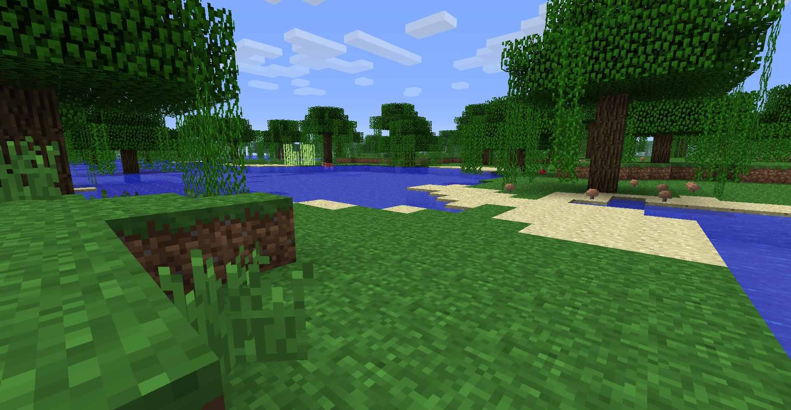
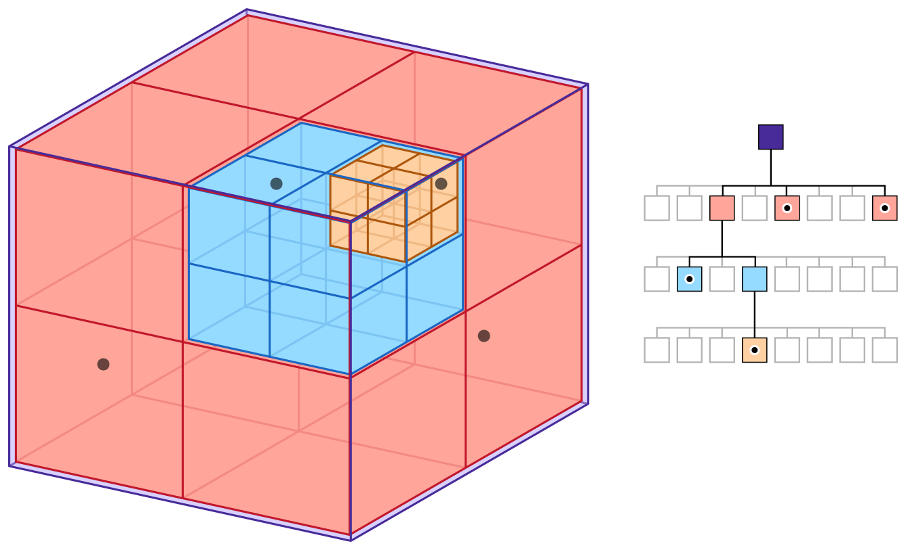

For me, Minecraft could easily be the greatest game of all time. The main reasons being that it is a "meta-game", a game that allows you to build other games.

The first time I played it I was confused by the absence of a story to follow or objective to complete. But the more I played it, the more I started to be addicted because I was building my own world and creating my own rules! The utter simplicity and freedom that a world made of blocks could create really impressed me. Furthermore, people online created (and still are creating) staggering detailed worlds and custom games using official and custom servers.

After playing Minecraft for a long time, I could not resist to try to build my own 3D engine and replicate the technology behind it. I read many articles which explained the inner workings of the game and then get to code.

When I got a prototype working, I was puzzled on what to make out of it.

I didn't want to embark in making a full video game, so I decided to build a self-contained experience, a [demo](https://en.wikipedia.org/wiki/Demoscene); or in simpler terms, an "interactive video".



The code is written in [D](https://dlang.org/) as at the time I decided it would become my go to language after a long search for a modern alternative to C++.

Reading through the code today, the most interesting things are: the world data structure and the renderer architecture.

The world is implemented as an [_octree_](https://en.wikipedia.org/wiki/Octree). An octree can be visualized as a giant cube that encloses all the space available for your world. Each node of the octree divides the space inside the cube in 8 sub-cubes. Then again each cube is recursively split in 8 more sub-cubes, until you arrive to the leaf nodes. A leaf node is the smallest representable unit of the world and it is represented as a single block on the screen.

An octree is ideal for a "Minecraft like" world for two reasons.

First, it naturally fits a world made of cubes beacause of its direct mapping of leaf nodes to world blocks.

Second, it is very memory efficient when there are big empty spaces because the leaf nodes are not required to exist at all in memory. That is in contrast to a simple three-dimensional array which would still need to allocate the memeory but mark all the empty elements as "null".

The renderer is built using OpenGL3 and therefore it uses the modern rendering pipeline using shaders. The render is also multithreaded by using multiple worker threads that build meshes in real time every time a world chunk is modified.

Another thing I love is the built in map editor that allowed me to create the world that you can see in the demo.



The source code is available on [GitHub](https://github.com/skilion/dreams) and it can be readily compiled on Windows and Linux. Pre-compiled binaries are also available.