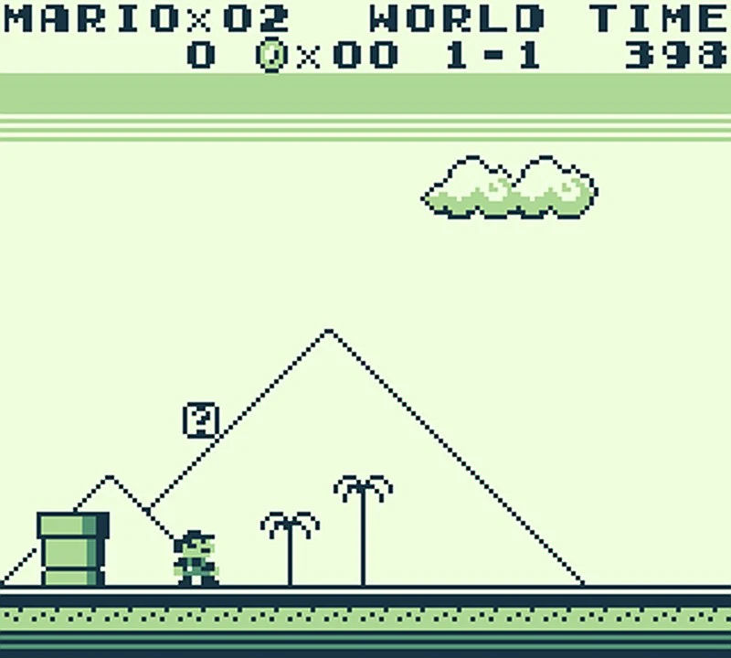
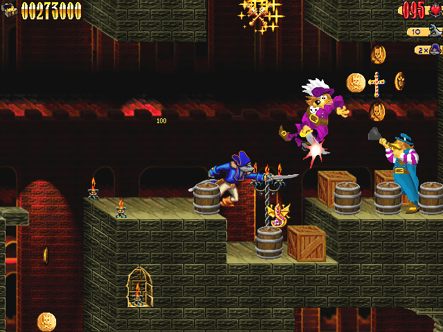

## Intro

"Jump And Run" is a game I developed towards the end of high school and the first project I am really proud of.

I was always attracted by the idea of building my own game but I had never tried it before. I had some basic experience with graphics from reading books and articles online but I only dabbled with some small graphical demos that I made during the long boring ours in our school lab.

One day I decided to build proper game that would be fun to play with levels and enemies to kill.

The end result suprised me, it turned out that I could turn my ideas into reality just by putting enough effort into it.

Here is a gameplay video of the first level:



## Background

When I was a kid the first type of video games I played were [2D Side Scrollers](https://en.wikipedia.org/wiki/Side-scrolling_video_game).

I still remember the two games which influenced me the most: [Super Mario Land](https://en.wikipedia.org/wiki/Super_Mario_Land) and [Captain Claw](https://en.wikipedia.org/wiki/Claw_(video_game)).

Super Mario was the first game I ever played. I played it on a [Game Boy](https://en.wikipedia.org/wiki/Game_Boy) which my cousins lend to me because my parents were against buying game consoles ("You would waste all your time!", so true in hindsight).

Later, when the first computer arrived in my home, my first PC game arrived shortly after. Captain Claw was so difficult for me and I never managed to beat the second level until a friend of mine (who had an internet connection! I still had not) discovered that [cheat codes](https://en.wikipedia.org/wiki/Cheating_in_video_games#Cheat_codes) were a thing.

"Jump And Run" is my tribute to those games and the endless hours I spent on them. I drew the art myself using [Gimp](https://www.gimp.org/), downloaded the music from the [Free Music Archive](https://freemusicarchive.org) and sounds from [Freesound](https://freesound.org/).

## Analysis

Re-reading today the code today I see a lot of ["code smells"](https://en.wikipedia.org/wiki/Code_smell) like huge functions and bad names, however keep in mind that I just finished high school when I wrote it :).

The game runs on a custom 2D Game Engine which I wrote in C++.

I appreciate how neatly the generic parts of the engine are split in virtual classes that make sense. The framework of the engine with its initialization code is separate from the game logic. I remember being deeply influenced from the code of famous game engines of the time such as [Unreal Tournament](https://github.com/stephank/surreal/) and [Quake 3 Arena](https://github.com/id-Software/Quake-III-Arena).

To draw on the screen I used [OpenGL](https://en.wikipedia.org/wiki/OpenGL) and for playing sounds I used [OpenAL](https://en.wikipedia.org/wiki/OpenAL).

I have forgotten how much time I spent rewriting much functionality of the standard library such as string and memory functions, file access, and various data structures. I was motivated by the fact that many game development articles recommended to avoid the standard library as it is not optimized for speed in most cases.

### Map Editor

I was very proud of the built-in map editor which allowed me to build maps with my basic drawing skills that would become alive with sound and enemies.

The game world is composed of small squares. Each square has a background and foreground texture taken from a [sprite sheet](https://en.wikipedia.org/wiki/Texture_atlas). Furthermore each square has a "type" property that can make it interact with the player by being solid, lethal, or a coin for example.



### Particle System

Another thing I remember fondly is the [particle system](https://en.wikipedia.org/wiki/Particle_system). It makes killing enemies very satisfying by releasing a swarm of "blood" particles which collide with the game world.



## Downloads

The source code is available on [GitHub](https://github.com/skilion/jump-and-run) and it can be readily compiled on Windows and Linux. Pre-compiled binaries are also [available](https://github.com/skilion/jump-and-run/releases).