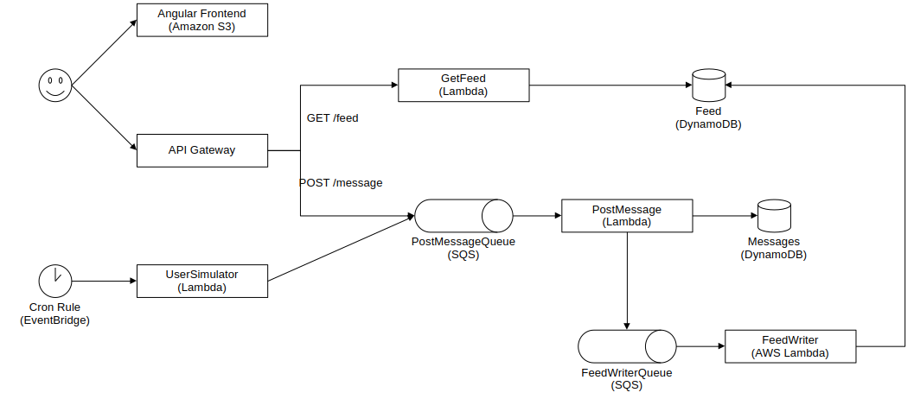
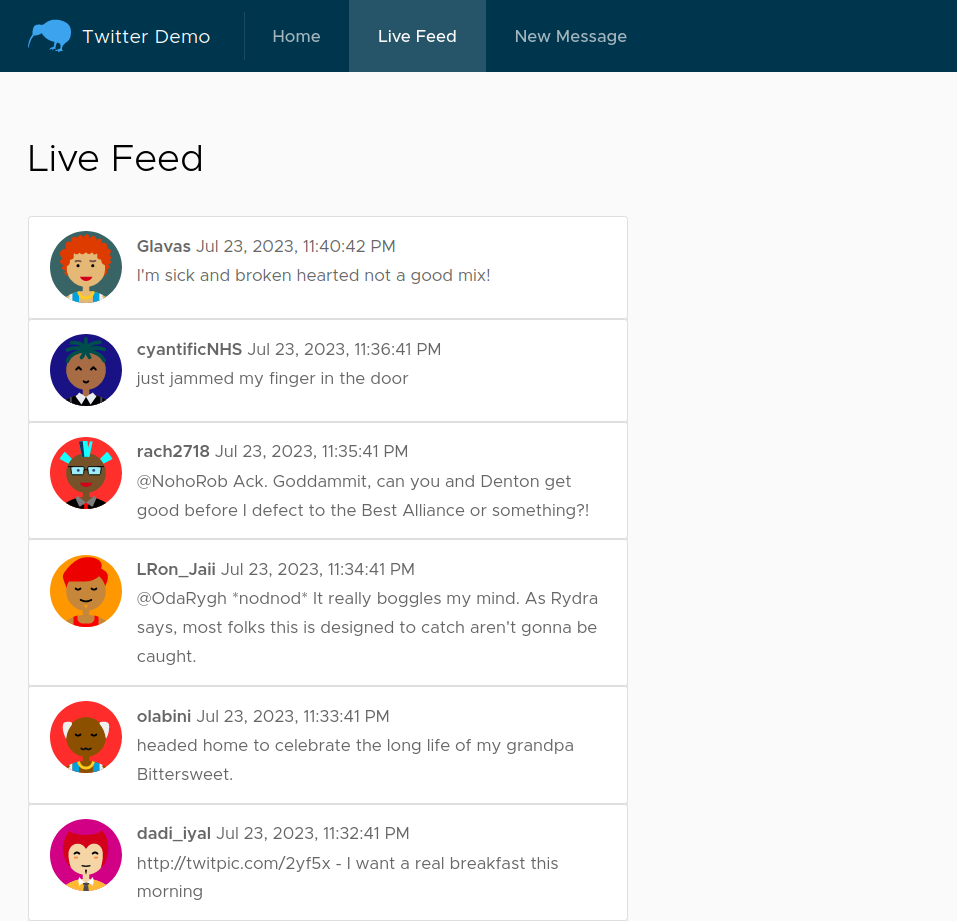

Lately I wanted to increase my hands-on knowledge about [Amazon Web Services (AWS)](https://aws.amazon.com/).

For me, the best way to learn a new technology is trying to build something with it. So, I spent some time pondering and come up with a the idea of creating a simple "Twitter like" web application.

The requirements I set were:
- To be able to see all the messages posted in the last 24h.
- To be able to post new messages.
- To automatically simulate multiple users posting messages every minute.
- To be able to scale for thousands of visitors.

I started by sketching a rough design for the architecture and then I went "shopping" on the AWS product page to see which services I could use. This is the end result:

Key decisions:
- The frontend will be a static [single-page application (SPA)](https://en.wikipedia.org/wiki/Single-page_application) which I could host directly on AWS S3.
- The backend endpoint for the APIs will be hosted on AWS Api Gateway.
- The backend services will be fully [serverless](https://en.wikipedia.org/wiki/Serverless_computing) using AWS Lambda.
- The storage for the system will be managed through DynamoDB.
- Queues will use AWS Simple Query Service (SQS).
- The whole infrastructure will be committed in the repository as [code](https://en.wikipedia.org/wiki/Infrastructure_as_code) by leveraging AWS Cloud Development Kit (CDK)

For the frontend, I chose Angular for no other reason than to keep it fresh in my mind. After all, this project is solely for learning purposes.

I made sure that I could host the whole system within the limits of the [AWS Free Tier](https://aws.amazon.com/free/), so that I would not have to pay in order to host a simple demo web application.

Here are a couple of tricks that I have learned.

## SQS Long Polling
Services monitoring SQS queues do so by periodically polling the queues to check for new messages. As SQS is priced on the number of request, it's essential to minimize the number of polls.

The recommended approach to achieve this is by enabling ["Long polling"](https://docs.aws.amazon.com/AWSSimpleQueueService/latest/SQSDeveloperGuide/sqs-short-and-long-polling.html). Long polling allows Amazon SQS to wait until a message is available in a queue before sending a response, significantly reducing the number of requests per second.

After setting the maximum wait time allowed for long polling, which is 20 seconds, I was expecting to see 3 requests per second in my queues. However, to my surprise, I noticed 15 requests per second in the monitoring dashboard. The mystery was solved by this [Stackoverflow question]( https://stackoverflow.com/questions/53372107/aws-sqs-long-polling-doesnt-reduce-empty-receives). It explains that queues wired to Lambdas (as in my architecture) are polled by 5 instances of the same Lambda by default, and this cannot be changed. While this caused a higher request rate, it is not a major concern for me since I have only two queues, and I will still be well below the threshold of the Free Tier for SQS.

## Backend endpoints in the Frontend
Integrating the URL of my backend endpoint into the frontend using AWS CDK proved to be a bit challenging.

Given that the frontend is static, it becomes necessary to hardcode the backend URL before building the Angular project. However, the nature of AWS CDK is to generate semi-random names for the declared services, making it impossible to guarantee that they won't change with future edits. Ideally, the AWS CDK should trigger the frontend build as soon as it knows the backend URL, but unfortunately, that's not possible.

The workaround I discovered is to split the architecture into two separate ["stacks"](https://docs.aws.amazon.com/cdk/v2/guide/stacks.html): one for the backend and one for the frontend. The backend stack can then utilize the ["output construct"](https://docs.aws.amazon.com/cdk/api/v2/docs/aws-cdk-lib.CfnOutput.html) to write the backend URL to a JSON file that can be directly referenced by the frontend.

## Live Demo

The live demo is hosted at: http://kiwi.aradaelli.com

Source code: https://github.com/skilion/kiwi