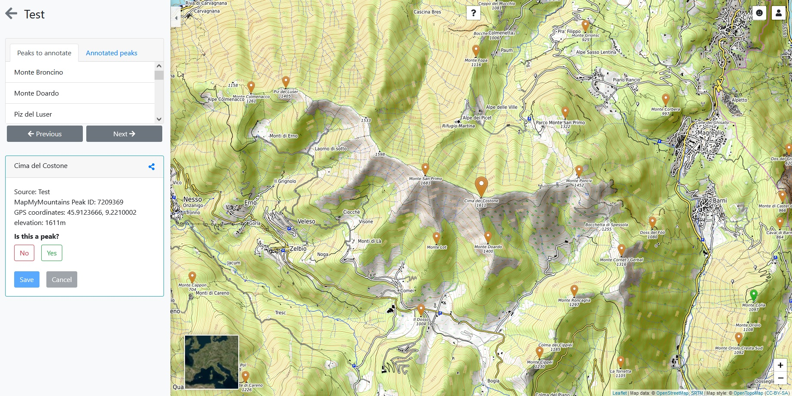
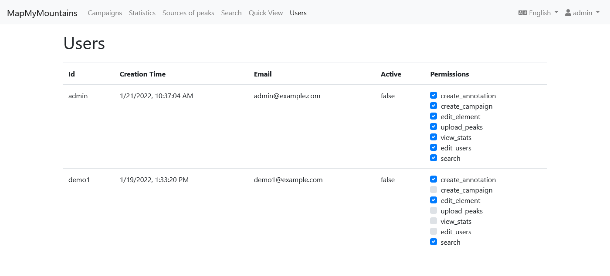
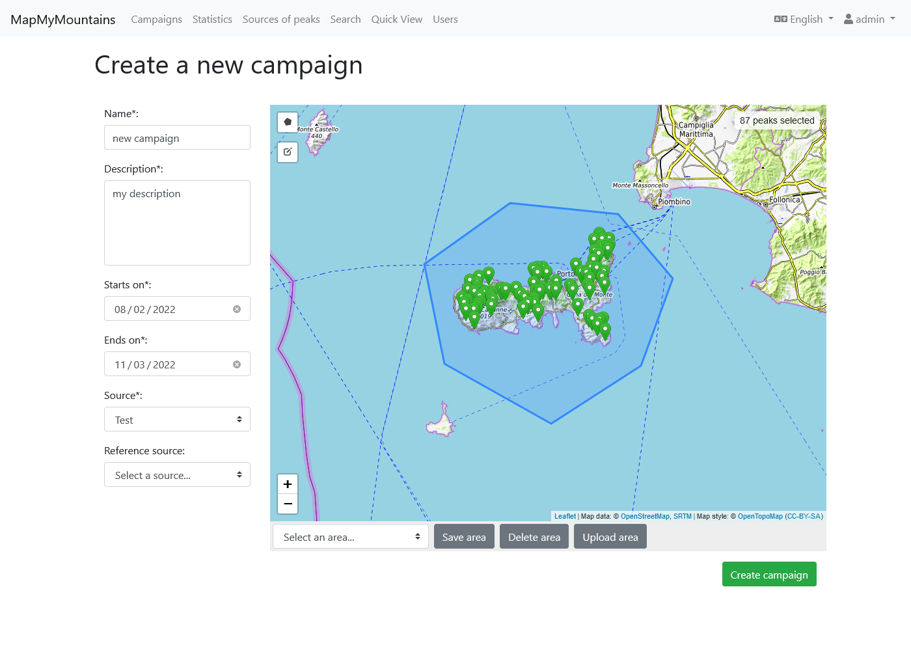

## Introduction

In Jan 2018, shortly after my graduation, I was offered a contract to work for a team of PhD students lead by [Prof. Piero Fraternali](https://fraternali.faculty.polimi.it/). The team operated as part of the ["Department of Electronics, Information and Bioengineering"](https://www.deib.polimi.it/eng/home-page) inside the university of [Politecnico di Milano](https://www.polimi.it/).

I was hired to develop a [Geographical Information System](https://en.wikipedia.org/wiki/Geographic_information_system) (GIS) from scratch to provide good quality data for an ongoing research project. The research project goal was to develop a [Machine Learning](https://en.wikipedia.org/wiki/Machine_learning) (ML) algorithm to recognize mountain peaks from the [Digital Elevation Model](https://en.wikipedia.org/wiki/Digital_elevation_model) (DEM) of the earth. Essentially a fancy way to find mountains using the 3D model of the earth.

The outcome of any ML project is highly dependent on the quality of data used as input therefore it is worth to have a good pipeline in place that can clean and filter data.

Furthermore we planned to use the data produced by the new GIS for ["Peaklens"](https://peaklens.com/) (created by the same team) which is an app that recognizes mountains using the camera of your smartphone. It works great and it is completely free, you should try it out for yourself!

## The Project

The project consisted of three main tasks:
1. Create a data model to store geographical data coming from different data sources with annotations and corrections.
2. Create multiple data pipelines to import publicly accessible geographical data sources into our data model.
3. Create a web application to allow human annotators to review the data and validate it through [crowdsourcing](https://en.wikipedia.org/wiki/Crowdsourcing).

## 1. Data Model

I kicked off the project with an iterative process of:
1. Collecting and defining the requirements as use cases.
2. Designing a data model to account for the use case.
3. Simulating the usage of the data model and finding new questions for the stakeholders.

The process required an interactive process with the people involved in the ongoing ML research project. [Here](https://1drv.ms/p/s!Ar26l2ZvsfJh-1EpLmzL8O9fvAsJ?e=tanGBv) is one of the presentations that was used to discuss the various use cases.

I sketched the data model as [Entity-Relationship](https://en.wikipedia.org/wiki/Entity%E2%80%93relationship_model) and iteratively improved until it satisfied all the requirements the system needed to support. You can see the final result [here](https://github.com/skilion/mapmymountains/tree/main/data-model).

We had informal meetings to decide which database to use. The alternatives were either a traditional relational database (PostgreSQL) or a NoSQL document database (MongoDB).

In the end we decided to go with PostgreSQL because:
- no need to scale (storage expectations <100GB, user base <100 people)
- it supports geometrical types out of the box which are convenient for geographical data (points, polylines, polygons)
- strong data consistency (the schema enforces types and relations)
- we expected the need for multiple JOINs between different data sources and user annotations

## 2. Import from Geographical Data Sources

Once the data model was defined, the next step was to import as much data as possible. For this reason I investigated publicly accessible geographical data sources, studied their format and APIs, wrote and tested scripts to download their data.

The data model is able to store reference to the unique original identifier of each downloaded element so we could have potentially contributed back to each source following the Open Source spirit of giving back to the community.

By the time my contract ended I had written scripts to import mountain peaks from:
- [Open Street Maps](https://www.openstreetmap.org/)
- [GeoNames](https://www.geonames.org/)
- [Canadian Geographical Names](https://www.nrcan.gc.ca/)
- [Open Data of Regione Lombardia](https://www.dati.lombardia.it/)

## 3. Crowdsourcing Web App

The last task was the development of a Web App to annotate and review the data. [Here](https://1drv.ms/w/s!Ar26l2ZvsfJh-2Ntn2FmqRLeCGiJ?e=EJBBAs) you can peek the requirements specification document.

For the tech stack we agreed on using [Node Js](https://nodejs.org/) for back-end and [Vue Js](https://vuejs.org/) for frontend, the main reason being keeping all the code base in Javascript. The web app was hosted on the private cloud of Politecnico di Milano which is based on [Open Stack](https://www.openstack.org/).

For visualizations I have used [Cesium Js](https://cesium.com/platform/cesiumjs/) which provides interactive 3D globes and [Leaflet Js](https://leafletjs.com/) for rendering 2D maps. For the UI I have used [BootstrapVue](https://bootstrap-vue.org/) which provides ready to use Vue components based on Bootstrap.

For the development process I have followed an Agile approach with 2 weeks sprints after which I demoed the new features and collected feedback for the next iteration.

I really enjoyed working on this project because it allowed me to get full-stack development experience and also some planning skills as I was fully entrusted in defining my tasks and delivering them. During the project I also mentored a student who then helped me in some development tasks.

## Live Demo

Before writing this article I decided to host a live instance of the Web App on Amazon AWS so that you can could see it live. I contacted Piero who kindly gave me permission to share the source code of the Web App for my portfolio, since it is not in use anymore.

"Resuscitating" a project that is "only" 3/4 years old proved to be more difficult than I thought.

I expected it to be fully working as I left it. However simply running it locally, using the latest stable Node Js resulted in some weird connection issues with the database that kept making my unit tests fail. I traced it back to the NPM library I used to connect to the DB (pg-promise) and updating it fixed the problem promptly.

I have also fall victim of a strange bug where the Vue CLI Service did not exit after finishing building the production bundle. This didn't cope well with my goal of having a CI pipeline because it makes the automated process hang and timeout. I fixed it again with more targeted package updates.

I have tried updating all the NPM packages at once but that resulted in many incompatibilities appearing between my code and the new packages. Since I did not want to spend time fixing code, I only did targeted updates for specific packages.

This proved me how unstable is the entire NPM/Node Js ecosystem. Today I rather use a self-contained web framework that provides everything out of the box such as ASP.NET, Django, Ruby on Rails, or Laravel, and stay away from the dependency hell that is the Javascript ecosystem with NPM.

For hosting the Web App I have used: Amazon RDS for the database (I created a PostgreSQL instance), Amazon Elastic Beanstalk for the back-end REST API, and Amazon S3 for the front-end (configured to serve a static website). Both the back-end and front-end are served on vanilla HTTP to avoid having to deal with SSL certificates.

Overall the setups works quite nicely, it fits well within the limit of the Amazon Free Tier. It also has continuous deployment thanks to Github Actions. 

You can find the live demo at: http://mapmymountains.aradaelli.com

## Credits

I want to mention the whole team at Politecnico di Milano with whom I have worked from 2018 to 2019. In 1 year I have learned a lot and I still have a great relationship with them:
- Piero Fraternali ([Website](https://fraternali.faculty.polimi.it/)-[Linkedin](https://www.linkedin.com/in/pierofraternali/)-[Google Scholar](https://scholar.google.co.uk/citations?user=IhFm8bIAAAAJ))
- Chiara Pasini ([Linkedin](https://www.linkedin.com/in/chiara-pasini-6091a7b5/)-[Google Scholar](https://scholar.google.co.uk/citations?user=KC8ZkF0AAAAJ))
- Darian Frajberg ([Linkedin](https://www.linkedin.com/in/darianf/)-[Google Scholar](https://scholar.google.co.uk/citations?user=fWJsLhgAAAAJ))
- Carlo Bernaschina ([Website](https://www.bernaschina.com/)-[Linkedin](https://www.linkedin.com/in/b3rn475/)-[Google Scholar](https://scholar.google.co.uk/citations?user=Pt83gAMAAAAJ))
- Nahime Torres ([Linkedin](https://www.linkedin.com/in/rocionahimetorres/)-[Google Scholar](https://scholar.google.co.uk/citations?user=7dZV0f8AAAAJ))
- Sergio Herrera Gonzalez ([Linkedin](https://www.linkedin.com/in/herrera-sergio/)-[Google Scholar](https://scholar.google.com/citations?user=lCD71y0AAAAJ))
- Federico Milani ([Website](https://www.milanif.it/)-[Linkedin](https://www.linkedin.com/in/federico-milani/)-[Google Scholar](https://scholar.google.com/citations?user=Mtj9iDAAAAAJ))
